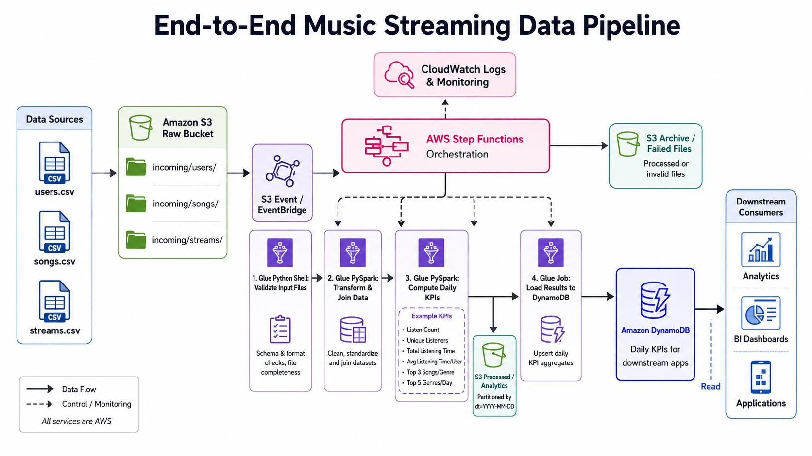

# Music Streaming Data Pipeline

[](https://github.com/GhGuda/music_streaming_pipeline/actions/workflows/ci.yml)


Event-driven AWS ETL pipeline that ingests music-streaming CSV files from Amazon S3, validates and transforms them with AWS Glue, computes daily genre-level KPIs in PySpark, and stores query-ready aggregates in Amazon DynamoDB. The whole pipeline is orchestrated by AWS Step Functions, triggered by EventBridge on object-created events, and provisioned with Terraform.


## Table of Contents

- [Architecture](#architecture)
- [KPIs Produced](#kpis-produced)
- [Input Schemas](#input-schemas)
- [Repository Layout](#repository-layout)
- [Prerequisites](#prerequisites)
- [Local Setup](#local-setup)
- [Deploy (dev)](#deploy-dev)
- [Running the Pipeline](#running-the-pipeline)
- [Verifying Outputs](#verifying-outputs)
- [KPI Dashboard](#kpi-dashboard)
- [DynamoDB Query Examples](#dynamodb-query-examples)
- [Testing](#testing)
- [CI/CD](#cicd)
- [Make Targets](#make-targets)
- [Troubleshooting](#troubleshooting)
- [Cleanup](#cleanup)
- [Security & Cost Notes](#security--cost-notes)
- [Roadmap / Status](#roadmap--status)
- [License & Maintainers](#license--maintainers)

## Architecture



Flow:

1. `users.csv` and `songs.csv` (dimensions) are uploaded once to `s3://<raw>/incoming/users/` and `s3://<raw>/incoming/songs/`.
2. A `streams*.csv` (events) upload to `s3://<raw>/incoming/streams/` fires an EventBridge `Object Created` event.
3. EventBridge starts the `music-streaming-<env>-pipeline` Step Functions state machine. Failed deliveries land in an SQS dead-letter queue.
4. **Validate** (Glue Python Shell) checks schemas + basic data quality, writes a `{status, reason, stream_key, stream_dates}` JSON to the scripts bucket. Step Functions reads it and branches on `status`.
5. On `VALID`, **Compute KPIs** (Glue PySpark) joins streams → songs → users, derives listening time, and writes Parquet to `silver/streams_enriched/` and `gold/{daily_genre_kpis,top_songs_by_genre,top_genres}/`, partitioned by `stream_date`.
6. **Load DynamoDB** (Glue Python Shell) upserts three item types into the KPI table for the touched dates.
7. **Archive Lambda** moves the source file from `raw/incoming/streams/` to `archive/processed/YYYY/MM/DD/`. Any failure routes to a second Lambda that writes the file to `archive/failed/YYYY/MM/DD/` along with an `*.error.json`.
8. CloudWatch logs, metrics, and a dashboard surface execution health; alarms fan out to SNS (email).

Infrastructure components (Terraform modules under `infra/modules/`): `kms`, `s3`, `iam`, `dynamodb`, `glue`, `lambda`, `step_functions`, `eventbridge`, `monitoring`, `dashboard`.

## KPIs Produced

All computed per day from the `listen_time` field on the trigger file.

| KPI | Definition | DynamoDB `sk` |
|---|---|---|
| Listen Count | Count of stream events for tracks in a genre per day. | `GENRE#<genre>` |
| Unique Listeners | Distinct `user_id` who streamed in the genre per day. | `GENRE#<genre>` |
| Total Listening Time | Sum of effective listen-seconds in the genre per day. | `GENRE#<genre>` |
| Avg Listening Time / User | Total listening time ÷ unique listeners. | `GENRE#<genre>` |
| Top 3 Songs per Genre | Three most-played tracks per (date, genre). | `GENRE#<genre>#TOP_SONGS` |
| Top 5 Genres per Day | Five most-popular genres by listen count. | `TOP_GENRES` |

> **Listening-time policy**: `streams.csv` has no duration column. The compute job uses `songs.duration_ms / 1000` (full-play assumption). To change the policy, edit the `effective_listen_seconds` expression in `glue_jobs/compute_kpis.py` — nothing downstream needs to change.

## Input Schemas

`users.csv`:

| Column | Type |
|---|---|
| `user_id` | int |
| `user_name` | string |
| `user_age` | int |
| `user_country` | string |
| `created_at` | date (`YYYY-MM-DD`) |

`songs.csv` (Spotify-style; 21 columns. Pipeline uses the five below; others are kept in silver for future use):

| Column | Type |
|---|---|
| `track_id` | string (join key) |
| `track_name` | string |
| `artists` | string |
| `track_genre` | string |
| `duration_ms` | int |

`streams.csv`:

| Column | Type |
|---|---|
| `user_id` | int (join key) |
| `track_id` | string (join key) |
| `listen_time` | timestamp `YYYY-MM-DD HH:MM:SS` (UTC) |

Sample fixtures live in `sample_data/`. Trimmed test fixtures live in `tests/fixtures/`.

## Repository Layout

```
infra/                       Terraform: dev environment and reusable modules
  envs/dev/                  Dev environment entrypoint (main, variables, outputs, tfvars, backend)
  modules/{kms,s3,iam,dynamodb,glue,lambda,step_functions,eventbridge,monitoring,dashboard}
glue_jobs/                   Glue scripts
  validate_inputs.py         Python Shell — schema + DQ validation
  compute_kpis.py            PySpark   — joins + KPI computation
  load_dynamodb.py           Python Shell — upsert items into the KPI table
  common/logging_utils.py    Shared structured-logging helpers
lambda/
  archive_success/handler.py Move raw stream file → archive/processed/
  archive_failure/handler.py Move raw stream file → archive/failed/ + *.error.json
  kpi_api/handler.py         Read-only KPI query API (served via API Gateway)
dashboard/                   Static web dashboard (HTML + CSS + JS + config template)
state_machine/pipeline.asl.json  Step Functions definition
tests/unit/                  Pytest suites (validation, KPI logic, DDB items, lambdas, kpi_api)
docs/
  architecture/              Architecture diagram
  runbook.md                 Operational runbook
  dynamodb_queries.md        Query reference (single-table + GSI1)
  frontend.md                KPI dashboard — UI guide, API reference, infrastructure
scripts/                     CLI helpers
  upload_sample.sh           Uploads users/songs + every streams*.csv (each uniquely-named)
  trigger_manual.sh          Starts a SFN execution against an existing S3 key
  invoke_failure_test.sh     Synthesises bad files and asserts the FAILED path
.github/workflows/           ci.yml (lint + test), cd.yml (quality + plan + environment-gated apply)
```

## Prerequisites

| Tool | Minimum | Why |
|---|---|---|
| AWS CLI | v2 | Auth + manual triggers + verification |
| Terraform | 1.6.0 | IaC for all AWS resources |
| Python | 3.11 | Matches Lambda runtime; tests + lint |
| AWS account | — | An IAM principal able to create S3, IAM, KMS, DynamoDB, Glue, Lambda, Step Functions, EventBridge, CloudWatch resources |
| (optional) Docker | recent | If you choose to package Lambdas in containers |

Configure AWS credentials before deploying:

```bash
aws configure
aws sts get-caller-identity   # sanity check
```

## Local Setup

```bash
python -m venv .venv
source .venv/bin/activate              # Windows: .venv\Scripts\activate
python -m pip install --upgrade pip
pip install -r requirements-dev.txt

# Run the same checks CI runs
make ci
```

## Deploy (dev)

```bash
make tf-init
make tf-validate
make plan       # produces infra/envs/dev/plan.tfplan
make apply
```

Or directly:

```bash
terraform -chdir=infra/envs/dev init
terraform -chdir=infra/envs/dev plan -out plan.tfplan
terraform -chdir=infra/envs/dev apply plan.tfplan
```

Set `alert_email` either in `infra/envs/dev/terraform.tfvars` or pass `-var "alert_email=..."` on apply. After apply, accept the SNS confirmation email so alarms fan out.

Key Terraform outputs:

```
kms_key_arn, raw_bucket_name, processed_bucket_name, archive_bucket_name, scripts_bucket_name,
dynamodb_table_name, state_machine_arn, state_machine_name,
glue_validate_job_name, glue_compute_job_name, glue_load_job_name,
archive_success_lambda_arn, archive_failure_lambda_arn,
eventbridge_rule_name, eventbridge_dlq_arn, eventbridge_dlq_url,
alerts_topic_arn, sfn_failed_alarm_name, eventbridge_dlq_alarm_name,
dashboard_url, dashboard_api_endpoint, dashboard_bucket_name
```

## Running the Pipeline

Upload dimensions first (they only need to be uploaded once or when refreshed):

```bash
export RAW_BUCKET=$(terraform -chdir=infra/envs/dev output -raw raw_bucket_name)

aws s3 cp sample_data/users/users.csv     s3://$RAW_BUCKET/incoming/users/users.csv
aws s3 cp sample_data/songs/songs.csv     s3://$RAW_BUCKET/incoming/songs/songs.csv
```

Trigger a run by uploading a stream file:

```bash
aws s3 cp sample_data/streams/streams1.csv \
  s3://$RAW_BUCKET/incoming/streams/streams_2024_06_25_part1.csv
```

EventBridge fires immediately; the Step Functions execution should appear in the console within seconds. To start a run manually (e.g. for reprocessing):

```bash
SM_ARN=$(terraform -chdir=infra/envs/dev output -raw state_machine_arn)

aws stepfunctions start-execution \
  --state-machine-arn "$SM_ARN" \
  --input "$(jq -n --arg b "$RAW_BUCKET" \
              '{detail:{bucket:{name:$b},object:{key:"incoming/streams/streams_2024_06_25_part1.csv"}}}')"
```

### Multiple files for the same day

The compute job uses an **aggregate-on-read** strategy: each execution reads the newly-arrived file **plus** any silver Parquet already written for the same `stream_date`(s), unions them, dedupes on `(user_id, track_id, listen_time)`, and re-aggregates the KPIs from the combined set. The result is **cumulative** KPIs across every stream file uploaded for that date.

Implications:

- Uploading `streams1.csv`, `streams2.csv`, `streams3.csv` for the same day produces DynamoDB items that reflect all three files, not just the last one to finish.
- Re-uploading the same file is idempotent — duplicate `(user_id, track_id, listen_time)` rows collapse during dedup.
- **Concurrent executions for the same date can race**: each one reads silver before the other has written, so the later writer wins and may miss the earlier one's contribution. Workaround for batch loads: upload files sequentially and wait for each execution to finish before starting the next.

## Verifying Outputs

```bash
PROCESSED=$(terraform -chdir=infra/envs/dev output -raw processed_bucket_name)
TABLE=$(terraform     -chdir=infra/envs/dev output -raw dynamodb_table_name)
ARCHIVE=$(terraform   -chdir=infra/envs/dev output -raw archive_bucket_name)

aws s3 ls s3://$PROCESSED/gold/daily_genre_kpis/    --recursive
aws s3 ls s3://$PROCESSED/gold/top_songs_by_genre/  --recursive
aws s3 ls s3://$PROCESSED/gold/top_genres/          --recursive
aws s3 ls s3://$ARCHIVE/processed/                  --recursive

aws dynamodb query --table-name "$TABLE" \
  --key-condition-expression "pk = :pk" \
  --expression-attribute-values '{":pk":{"S":"DATE#2024-06-25"}}'
```

## KPI Dashboard

Quick access after deploy:

```bash
terraform -chdir=infra/envs/dev output -raw dashboard_url
terraform -chdir=infra/envs/dev output -raw dashboard_api_endpoint
```

Open the `dashboard_url` output in your browser. Do not open `dashboard/index.html` directly as a `file://` URL for deployed testing; Terraform renders and uploads `config.js` with the API Gateway URL, while the local source tree only contains `config.js.tpl`.

After deployment a static web dashboard is available at the `dashboard_url` Terraform output:

```bash
terraform -chdir=infra/envs/dev output -raw dashboard_url
```

The dashboard is a single-page app served from S3. It calls a read-only API (API Gateway HTTP API → Lambda → DynamoDB) and renders:

- **Summary cards** — total listens, unique listeners, total listening time, genre count
- **Daily Genre KPIs** — full per-genre breakdown for any date in DynamoDB
- **Top Genres** — ranked top-5 genres by listen count
- **Top Songs** — ranked top-3 tracks for the selected genre

Use the Date and Genre dropdowns to navigate across dates and genres. Hit **Refresh** after a new pipeline run to pick up the latest data.

For the full API reference, source file descriptions, infrastructure details, and troubleshooting see [`docs/frontend.md`](docs/frontend.md).

## DynamoDB Query Examples

```bash
# All KPI items for a day
aws dynamodb query --table-name "$TABLE" \
  --key-condition-expression "pk = :pk" \
  --expression-attribute-values '{":pk":{"S":"DATE#2024-06-25"}}'

# One genre on one day
aws dynamodb get-item --table-name "$TABLE" \
  --key '{"pk":{"S":"DATE#2024-06-25"},"sk":{"S":"GENRE#afrobeat"}}'

# Top 3 songs for (date, genre)
aws dynamodb get-item --table-name "$TABLE" \
  --key '{"pk":{"S":"DATE#2024-06-25"},"sk":{"S":"GENRE#afrobeat#TOP_SONGS"}}'

# Top 5 genres for a day
aws dynamodb get-item --table-name "$TABLE" \
  --key '{"pk":{"S":"DATE#2024-06-25"},"sk":{"S":"TOP_GENRES"}}'
```

For sort-key prefix queries, GSI1 cross-day genre lookups, projection / pagination, and a `boto3` reference, see [`docs/dynamodb_queries.md`](docs/dynamodb_queries.md).

## Testing

```bash
pip install -r requirements-dev.txt
python -m pytest -q                 # all suites
python -m pytest tests/unit -v      # verbose
python -m pytest --collect-only -q  # quick sanity check
```

Notes:

- Tests follow the rule: source modules expose pure functions (`build_daily_genre_kpi_item`, `compute_daily_genre_kpis_records`, `validate_columns`, …) that the suites call directly with plain dicts/lists. No AWS calls are made.
- Lambda handlers are imported via `importlib.import_module("lambda.archive_success.handler")` because `lambda` is a Python reserved word — pytest's `pythonpath = ["."]` in `pyproject.toml` is what makes that resolve.
- `pyproject.toml` configures `ruff`, `black`, and `pytest`.

## CI/CD

### Continuous Integration — `.github/workflows/ci.yml`

Runs on every push and pull request:

1. Set up Python 3.11.
2. `pip install -r requirements-dev.txt`.
3. `ruff check .`
4. `black --check .`
5. `pytest -q`

### Continuous Deployment — `.github/workflows/cd.yml`

Triggers on push to `main` when anything under `infra/`, `state_machine/`, `glue_jobs/`, `lambda/`, or `.github/workflows/cd.yml` changes. Also supports `workflow_dispatch` for manual runs.

Two-stage pipeline:

1. **Quality + Plan** — `terraform fmt -check`, `terraform init/validate`, `tflint`, `checkov` (security scan, SARIF uploaded to GitHub's Security tab), then `terraform plan -out tfplan.binary`. The plan is rendered into the workflow's job summary and uploaded as an artifact with the `.terraform.lock.hcl`.
2. **Apply (dev)** — gated by the GitHub Environment `dev`. Downloads the plan artifact and runs `terraform apply tfplan.binary` against the exact plan that was reviewed. Captures `terraform output -json` into a second artifact.

OIDC is used throughout (`aws-actions/configure-aws-credentials@v4` with `id-token: write`) — no long-lived AWS keys live in the repo. A concurrency group (`cd-dev`) prevents two CD runs racing the Terraform state.

### One-time GitHub setup

In **Settings → Environments** create one environment:

| Environment | Required reviewers | Branch restriction | Environment secret | Environment var |
|---|---|---|---|---|
| `dev` | optional (set if you want a human in the loop) | `main` only | `AWS_ROLE_ARN_DEV` | `ALERT_EMAIL` |

In **AWS**, create an IAM role trusted by the GitHub OIDC provider (`token.actions.githubusercontent.com`) and scoped to this repo. The role needs permissions to manage the AWS resources Terraform creates (KMS, S3, IAM, DynamoDB, Glue, Lambda, Step Functions, EventBridge, CloudWatch, SNS).

The role's trust policy should look like:

```json
{
  "Effect": "Allow",
  "Principal": { "Federated": "arn:aws:iam::<account-id>:oidc-provider/token.actions.githubusercontent.com" },
  "Action": "sts:AssumeRoleWithWebIdentity",
  "Condition": {
    "StringEquals": {
      "token.actions.githubusercontent.com:aud": "sts.amazonaws.com"
    },
    "StringLike": {
      "token.actions.githubusercontent.com:sub": "repo:<org>/<repo>:environment:dev"
    }
  }
}
```

(Or use `repo:<org>/<repo>:ref:refs/heads/main` if you prefer branch-scoped over environment-scoped.)

## Make Targets

| Target | What it does |
|---|---|
| `make fmt` | `black .` + `ruff check . --fix` |
| `make lint` | `ruff check .` + `black --check .` |
| `make test` | `pytest -q` |
| `make ci` | `lint` + `test` |
| `make tf-init` | `terraform init` on `infra/envs/dev` |
| `make tf-validate` | `terraform validate` on `infra/envs/dev` |
| `make plan` | Writes `infra/envs/dev/plan.tfplan` |
| `make apply` | Applies `infra/envs/dev/plan.tfplan` |
| `make empty-buckets` | Empties raw/processed/archive/scripts buckets |
| `make destroy` | `terraform destroy` |
| `make destroy-all` | `empty-buckets` then `destroy` |

On Windows without GNU Make, use `mingw32-make` or invoke the underlying commands directly.

## Troubleshooting

| Symptom | Likely cause | First step |
|---|---|---|
| EventBridge doesn't trigger | `aws_s3_bucket_notification.eventbridge = true` missing on raw bucket, or rule pattern doesn't match the key. | `aws events list-rule-names-by-target --target-arn $SM_ARN` |
| Step Functions execution stays in `RUNNING` for >10 min on `ValidateInputFiles` | Glue Python Shell capacity exhausted or IAM permission. | CloudWatch `/aws-glue/python-jobs/output` |
| Step Functions branches to `MoveToFailed` immediately | Validation rejected the file. | Read `s3://<scripts>/validation_results/<execId>.json` |
| Glue job fails on S3 read | Glue role missing `s3:GetObject`/`s3:ListBucket` on raw bucket. | `infra/modules/iam/policies/glue_policy.json` |
| Glue job fails on DynamoDB write | Glue role missing `dynamodb:PutItem`/`BatchWriteItem`. | Same policy file |
| EventBridge events not delivered | SQS DLQ has messages; check `eventbridge_dlq_url`. | `aws sqs receive-message --queue-url $DLQ_URL` |
| Alarms not arriving by email | SNS subscription not confirmed. | Check inbox for the SNS confirmation link |

For full incident triage — alarm-to-cause mapping, log group locations, stage-by-stage recovery, date reprocessing, PITR restore, DLQ replay, KMS rotation, cost-spike investigation, and the escalation matrix — see [`docs/runbook.md`](docs/runbook.md).

## Cleanup

```bash
make destroy-all   # empties buckets, then terraform destroy
```

Or step-by-step:

```bash
make empty-buckets
make destroy
```

If `terraform destroy` complains about a non-empty bucket, run `make empty-buckets` and retry.

## Security & Cost Notes

- **Encryption**: A customer-managed KMS key encrypts S3 (SSE-KMS), DynamoDB, the EventBridge DLQ, and CloudWatch log groups.
- **IAM**: Each service has its own role with policies scoped to specific resource ARNs (see `infra/modules/iam/policies/*.json`).
- **Public access**: All pipeline S3 buckets have Block Public Access enabled. The dashboard bucket is intentionally public-read (static HTML/CSS/JS assets are not sensitive); it has no KMS encryption.
- **DynamoDB**: PAY_PER_REQUEST billing; PITR enabled.
- **Glue**: Two G.1X workers on the compute job (~$0.44/hour while running); Python Shell jobs at 0.0625 / 1.0 DPU.
- **Lambda**: Pay-per-invocation; the two archive functions only run once per pipeline execution.
- **CloudWatch logs**: Retention 30d (configurable).

## Roadmap / Status

Built and wired:

- KMS, S3, IAM, DynamoDB, Glue, Lambda, Step Functions, EventBridge, monitoring, dashboard Terraform modules.
- Three Glue scripts (validate, compute, load) with pure-function cores covered by unit tests.
- Two Lambda archive handlers (success/failure) with unit tests.
- Read-only KPI API Lambda + API Gateway HTTP API (`lambda/kpi_api/`).
- Static S3-hosted dashboard with vanilla JS (`dashboard/`).
- ASL state machine with Choice + Catch + Retry on every stage.
- CI (`ci.yml`) running ruff + black + pytest.
- CD (`cd.yml`) — quality + plan + environment-gated apply for dev on push to `main`. OIDC, `tflint`, `checkov` SARIF, plan-as-artifact handoff between jobs.
- Operational runbook (`docs/runbook.md`), DynamoDB query reference (`docs/dynamodb_queries.md`), and frontend guide (`docs/frontend.md`).
- CLI helpers: `scripts/upload_sample.sh`, `scripts/trigger_manual.sh`, `scripts/invoke_failure_test.sh`.

Still TODO:

- One-time GitHub setup: create the `dev` Environment, the OIDC IAM role, and the environment secret / variable described in the [CI/CD section](#cicd).
- `LICENSE` file.
- Optional: `pre-commit` config (`.pre-commit-config.yaml`) wired to ruff/black/terraform fmt.
- Optional: dependency lockfile via `pip-tools` or `uv`, with `pip install --require-hashes` in CI.
- Optional: `.tflint.hcl` / `.checkov.yml` to pin rule sets and suppress documented accepted-risk findings.

## License & Maintainers

- **License**: No license yet.
- **Maintainer**: GhGuda (`toyboipressure1@gmail.com`).
